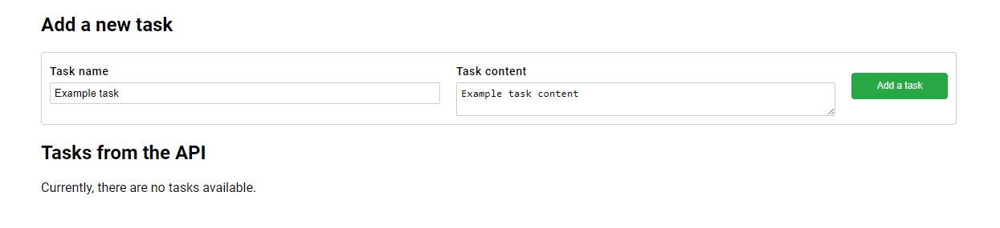
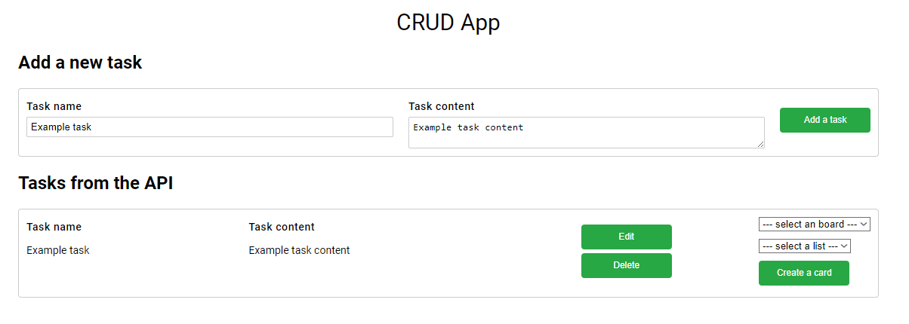
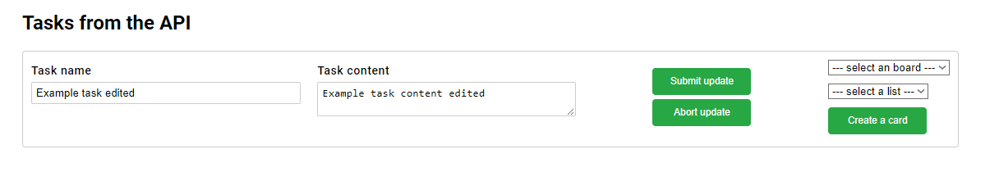
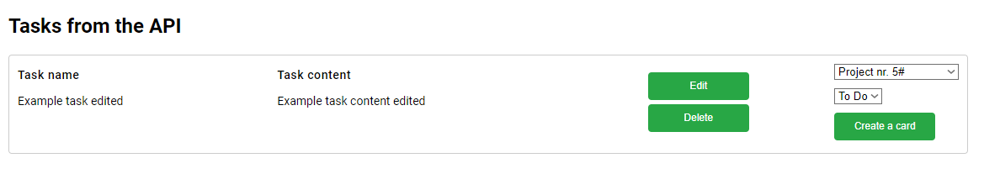
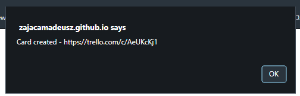
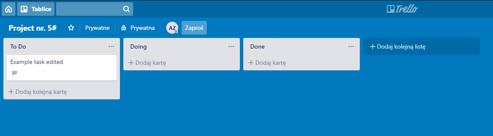
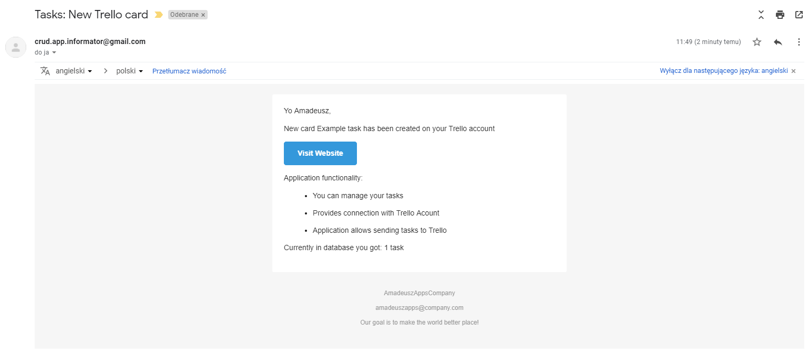
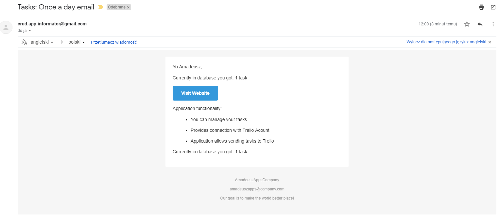

# rest-tasks-app
Simply CRUD Application connected with Trello API.

## Table of Contents:
* [General info](#general-info)
* [Technologies](#technologies)
* [Features](#features)
* [Demo](#demo)
* [Screenshots](#screenshots)

## General info
Application can add tasks from app to our boards on Trello account.

## Technologies:
1. Database: MySQL (locally) / PostreSQL (heroku)
2. Libraries: Spring Boot, Hibernate, Lombok, Thymeleaf, Swagger
3. HTTP methods: GET, POST, PUT, DELETE

## Features:
* Works as simply ToDo List,
* You can add, edit and remove tasks from list,
* Possibility adding tasks to your private Trello board,
* Email confirmation every time you add new task to Trello board
* Daily email information about quantity of tasks

## Demo:
https://zajacamadeusz.github.io/rest-springboot-app/

## Screenshots
1. Create new task

2. Then confirm and task should be added to list

3. You can also edit tasks from the list

4. Add task to your connected Trello board

5. Wait for confirmation

6. Task should be visible in your Trello board

7. You will get also mail confirmation about new added task to Trello

8. Once a day you get mail information about the quantity of the tasks in your web application

